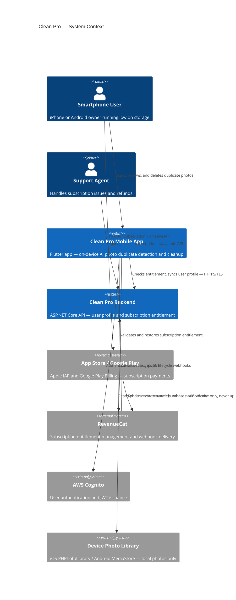
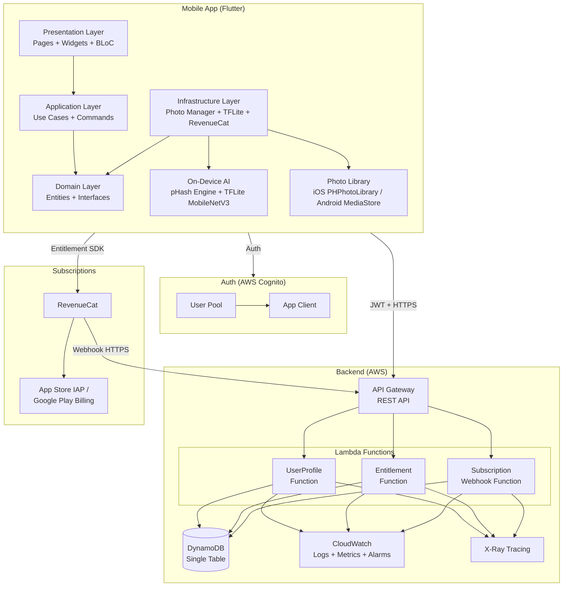
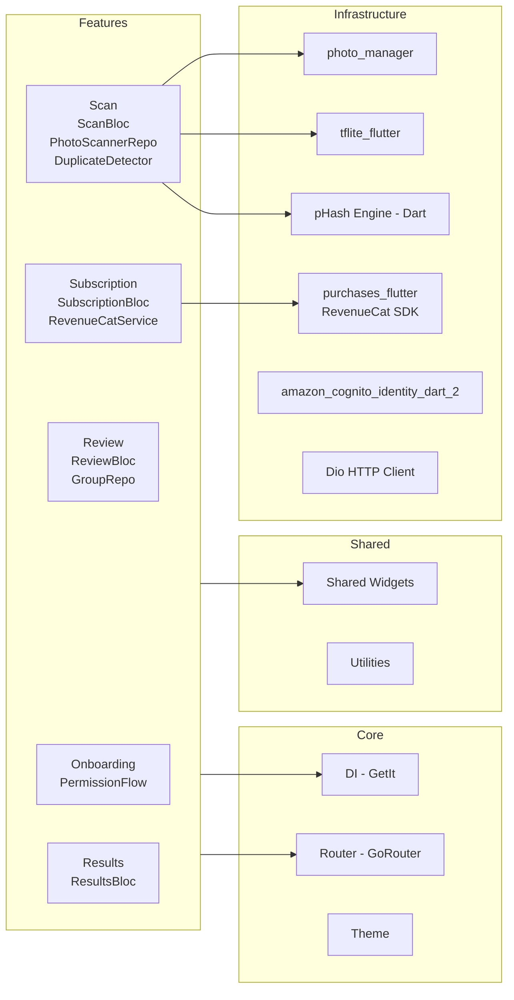
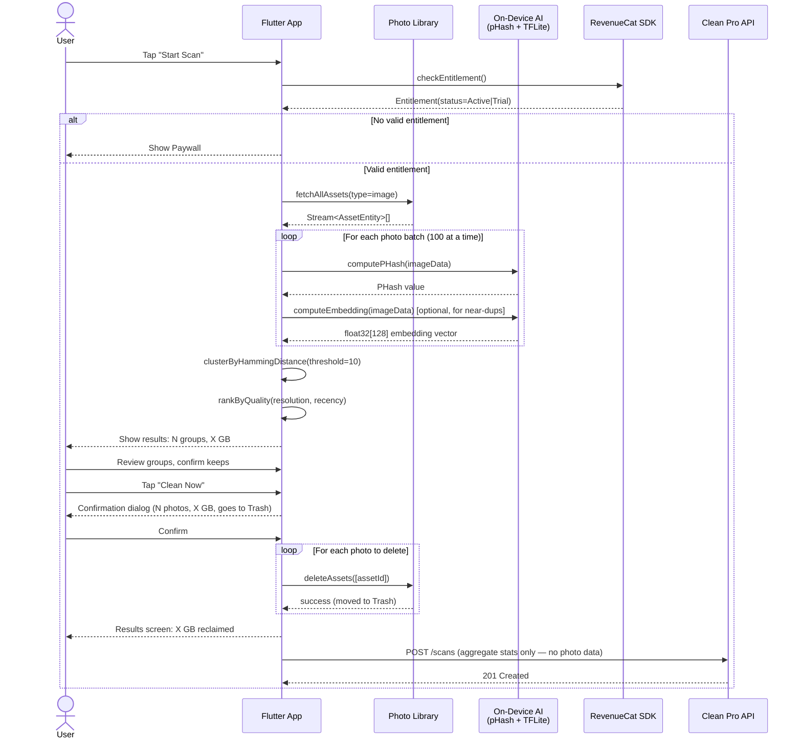
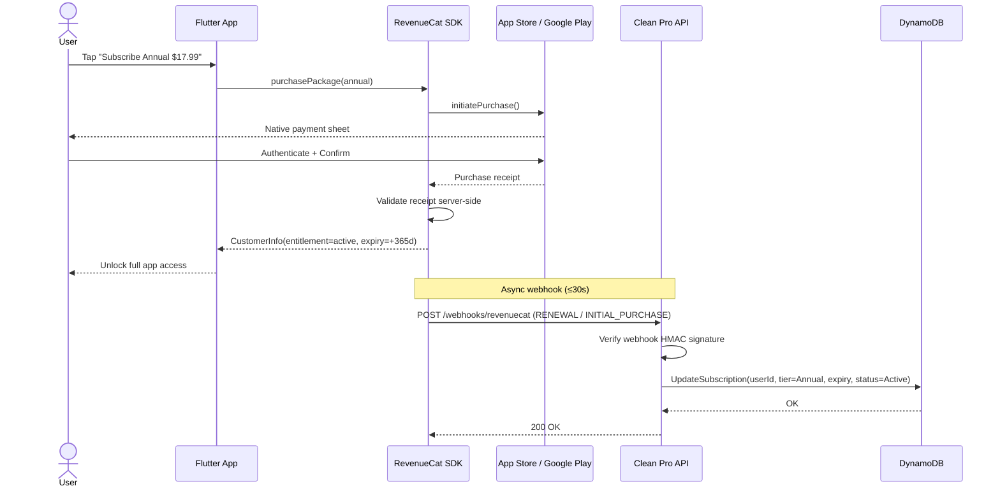
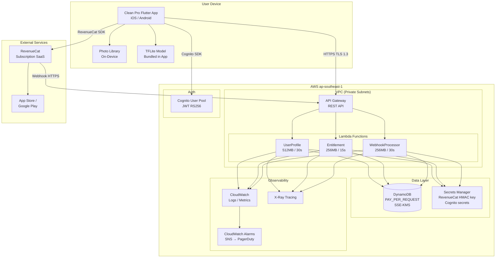
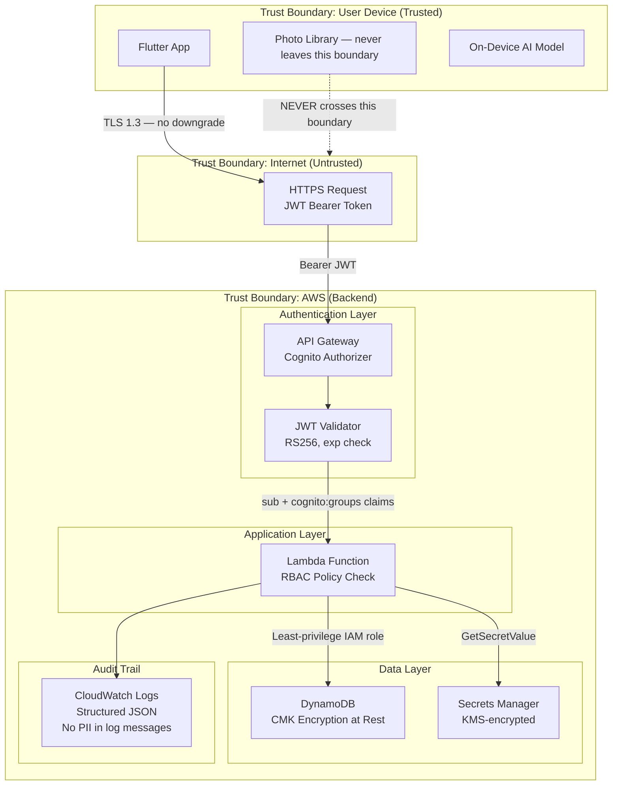
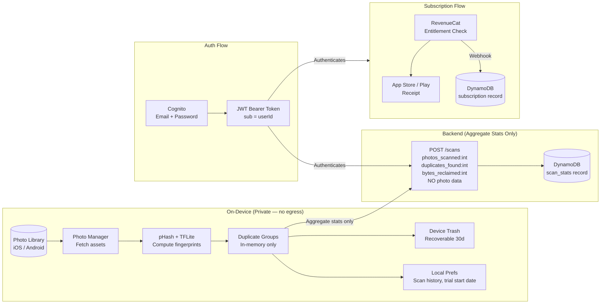

# Clean Pro — Architecture Diagrams

## 1. Context Diagram

## 2. System Architecture Diagram

## 3. Component Diagram — Mobile

## 4. Sequence Diagram — Photo Scan & Delete Flow

## 5. Sequence Diagram — Subscription Purchase Flow

## 6. Deployment Diagram

## 7. Security Architecture Diagram

## 8. Data Flow Diagram

